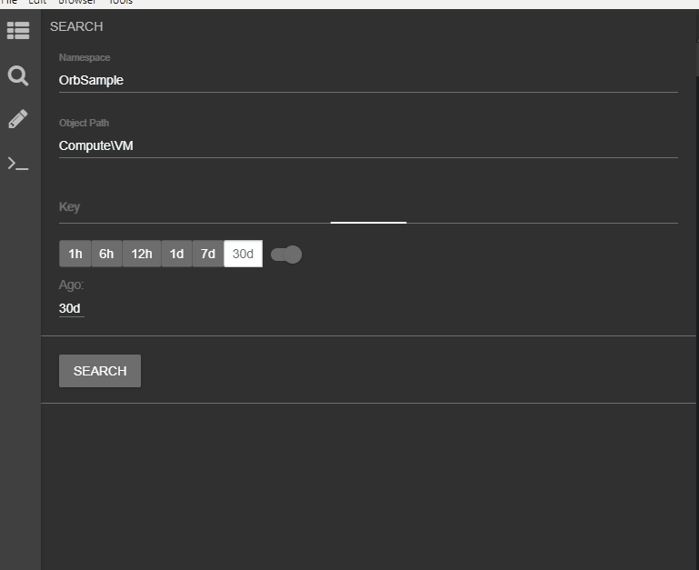
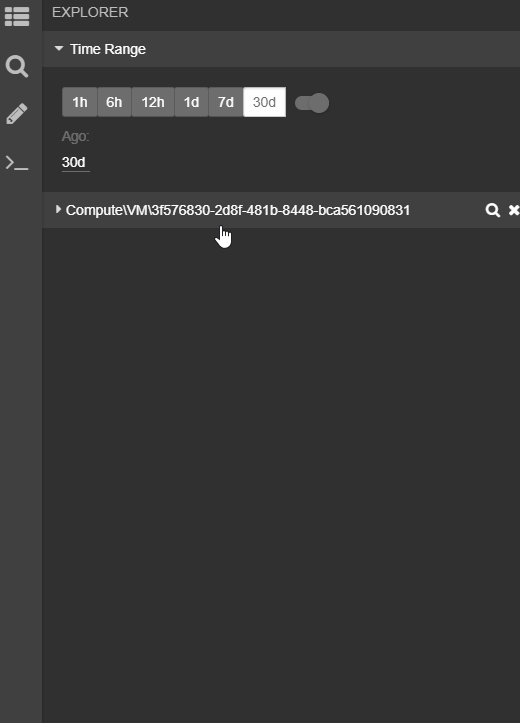

# Basic Concepts

## Objects
Objects are the primary entry point used for exploration.
Objects are user defined and can be anything you'd like to model as part of handling your live site.
Objects contain a tree of Resources that you can interact with in the Explorer view.

> An object could be a Service Endpoint, the Virtual Machine (VM)/Container the service runs on, API calls, workflows and more.

To find an object, use the Search view from the Nav Bar on the left.

## Resources 
The simplest example of a resource is a web link. Resource could also be saved ADX queries, dashboards, scripts and more.
Every resource belongs to a parent object and is related to it in some way.

Resources are defined by stripping out parts of the resource that contain object specific context like the Object Id.

For example,

*An Azure Virtual Machine Object can have a Resource that is a link to Events for that specific Virtual Machine.*

Let's say that the following link shows you Virtual Machine Events for a VM with id "bar":

<pre>
https://vmEvents.azurewebsite.net?vmId=bar
</pre>

A resource definition for the above would look like this:

<pre>
https://vmEvents.azurewebsite.net?vmId={vmId}
</pre>

Note that "bar" has been replaced with "{vmId}" in the resource definition. This allows the link to be auto-populated with the right VM Id based on the context.

## Object Context
Every object in the Explorer view has context associated with it.
This context is used to convert a generic resource definition to a concrete resource.

In the example above, if VM "bar" is selected in Explorer, "{vmId}" will automatically be replaced in all resource definitions.

## Associations
Related objects are joined together through associations.
Navigating to a related object generates a resource tree for that object in Explorer.

For example, an Azure VM is related to a Subscription. If VM "bar" is selected in Explorer, its Subscription Id and the entire resource tree for that Subscription can be browsed in Explorer.

At the moment, ADX/PowerShell associations are supported. Relationship between objects must be expressed through ADX queries/PowerShell scripts.

## Model Repository
The model repository is a Git repo that stores all saved resources and object definitions. 

> Users submit changes to Orb models through Pull Requests (PRs). PRs can be initiated from within Orb.

Only Azure DevOps git repositories are supported at this point.

## Object Search
Object search is the entry point to locate objects. When Orb starts up, it syncs all files in the model repository and looks for object definition files. Each object definition file contains the queries that help Orb search for that object and discover other connected objects.  

For example, here is a snippet from the Object Definition file for a VM:
 
 ```json
     "namespace": "OrbSample",
    "path": "Compute\\VM",
    …
    "constructor": {
        "query": "VMSnapshot | where {timeRange} and VMId =~ \"{VMId}\" | take 1 | project VMId",
        "wildcardQuery": "VMSnapshot | where {timeRange} and VMId matches regex \"{VMId}\" | summarize by VMId",
        "minimumResolutionInMinutes": 120
    },
 ```
 By adding this object definition, this object becomes available to search in Orb.
 
 
 
 Under the covers, when the search button is clicked, the following query is run:
 
 <pre>
 VMSnapshot | where PreciseTimeStamp >= ago(30d) and VMId =~ "3f576830-2d8f-481b-8448-bca561090831" | take 1 | project VMId </pre>
 
The parameter {VMId} is replaced with whatever is in the search box and {timeRange} is replaced with the time range selected on the UI. The minimum time range for this object search is specified by minimumResolutionInMinutes, which is 2 hours (2x the snapshot interval). This kind of parameter replacement is the building block that is used throughout Orb.
Since a match was found for that query, the result is displayed. Search strings can also contain wildcards for multiple matches.

You can also search for object IDs without knowing the type of object and Orb will run multiple parallel queries to scan all object definitions. This is handy if you are dealing with an incident or support ticket with partial information. Once an object is found, you can click on it to add it to the explorer page. When an object is added to the explorer, all properties associated with that object are available for future parameter substitution.

## Object Explorer
The object explorer page lets you visualize connected objects. Inside an object definition, you can specify how one object is linked to another. This is a sample association modeled inside the VM object definition file.

```json
"associations": [
        {
            "relativePath": "Host",
            "associatedObjectPath": "Compute\\Host",
            "query": "VMSnapshot | where {timeRange} and VMId == \"{VMId}\" | take 1 | project HostId",
            "minimumResolutionInMinutes": 120
        },
```

 
 
 As an association is clicked (indicated by the purple icon), the query that locates a connected object is run. In this case, to find the connected host, the VMSnapshot query is run after replacing all variables. VMId is a property stored in the object context, so it can be used throughout the object definition. Associations also factor in time – in this example if a VM was migrated from one host to another, the time range specified in the explorer page can alter the results. If multiple entries are found, all connected objects are displayed. Similarly, a host server object is linked to a rack and all other VMs on the host.
 
## Resource Types

Each of the resource types below have specific resource handlers that automatically contextualize the resource based on the object context.

Resource Extension | Description
------------ | -------------
.link | General purpose contextual web link.
.kusto | Kusto/ADX query. 
.psx | PowerShell scripts that are opened in an external PowerShell window.
.terminal | PowerShell scripts that are opened in Orb terminals.
.psmd | PowerShell scripts that are rendered as markdown pages.
