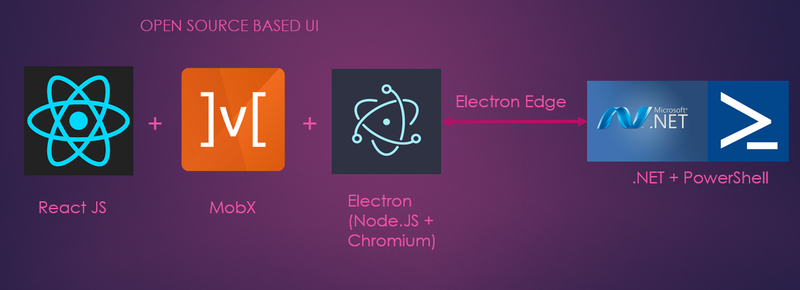

# Orb Architecture

## Electron
Orb is built on the same open-source platform that powers VSCode and many others.
Electron is a framework for creating native applications with web technologies like JavaScript, HTML, and CSS.
You can learn more about it here:

<a href= "http://electron.atom.io/" target="_blank">http://electron.atom.io/</a>

## Built on Open-Source

Orb uses React JS and MobX for rendering and state management along with several other open-source node.JS modules.

* <a href= "https://facebook.github.io/react/" target="_blank">https://facebook.github.io/react/</a>
* <a href= "https://mobx.js.org/" target="_blank">https://mobx.js.org/</a>

## Electron Edge

This open-source module allows running .NET side-by-side with node.JS. This allows us to run PowerShell inside Orb. i.e. run PowerShell, render in Javascript.

<a href= "https://github.com/kexplo/electron-edge" target="_blank">https://github.com/kexplo/electron-edge</a>

